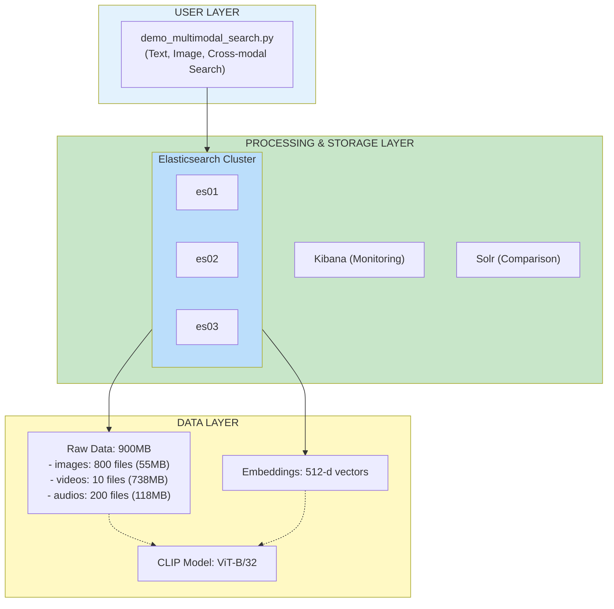
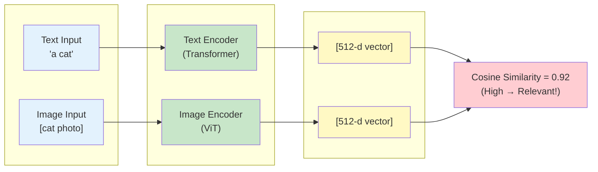
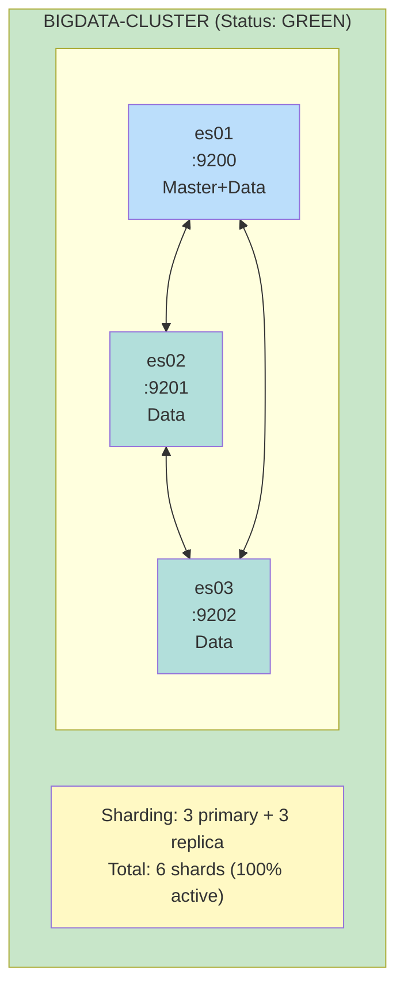
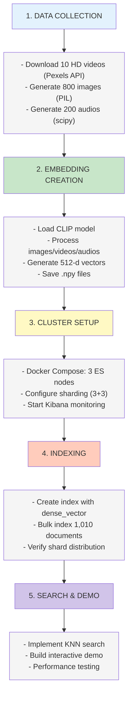

# SLIDE BÁO CÁO - POWERPOINT OUTLINE

## ỨNG DỤNG ELASTICSEARCH ĐỂ XÂY DỰNG HỆ THỐNG TÌM KIẾM NỘI DUNG ĐA PHƯƠNG TIỆN SỬ DỤNG EMBEDDING VECTOR

---

## SLIDE 1: TRANG BÌA

**Title:**
ỨNG DỤNG ELASTICSEARCH ĐỂ XÂY DỰNG
HỆ THỐNG TÌM KIẾM NỘI DUNG ĐA PHƯƠNG TIỆN
SỬ DỤNG EMBEDDING VECTOR

**Subtitle:**
Bài tập lớn - Phân tích Dữ liệu Lớn

**Info:**

- Giảng viên: ThS. Nguyễn Đắc Phương Thảo
- Sinh viên: [Tên sinh viên]
- Lớp: 64HTTT4

**Footer:**
Trường Đại học Thủy Lợi - Khoa CNTT
Hà Nội, 2025

**Background:** Gradient blue/tech theme

---

## SLIDE 2: MỤC LỤC

**Title:** MỤC LỤC

1. **Tổng quan đề tài**

   - Đặt vấn đề
   - Mục tiêu

2. **Cơ sở lý thuyết**

   - Elasticsearch
   - CLIP Model

3. **Triển khai hệ thống**

   - Dataset
   - Cluster Architecture
   - Vector Search

4. **Kết quả và đánh giá**

   - Performance
   - So sánh ES vs Solr

5. **Kết luận & Hướng phát triển**

---

## SLIDE 3: ĐẶT VẤN ĐỀ

**Title:** ĐặT VẤN ĐỀ

**Problems:**
❌ **Thách thức hiện tại:**

- Dữ liệu đa phương tiện bùng nổ (hàng tỷ images/videos mỗi ngày)
- Tìm kiếm truyền thống dựa metadata không hiệu quả
- Không hiểu nội dung semantic
- Không hỗ trợ cross-modal search

✅ **Giải pháp:**

- Sử dụng AI embeddings (CLIP) để hiểu nội dung
- Elasticsearch cluster phân tán cho Big Data
- Vector search với cosine similarity
- Cross-modal: Text → Image/Video/Audio

**Visual:** Icon/diagram showing traditional search vs AI-powered search

---

## SLIDE 4: MỤC TIÊU DỰ ÁN

**Title:** MỤC TIÊU NGHIÊN CỨU

**Tổng quát:**
🎯 Xây dựng hệ thống tìm kiếm multimodal phân tán

**Cụ thể:**

✅ **Dataset**

- Thu thập ~900MB multimedia data
- 800 images + 10 real HD videos + 200 audios

✅ **AI Embeddings**

- CLIP model: openai/clip-vit-base-patch32
- 512-dimensional vectors
- Cross-modal capability

✅ **Distributed System**

- Elasticsearch cluster: 3 nodes
- Sharding & Replication
- High availability

✅ **Performance**

- Latency < 100ms
- Throughput > 10 QPS

---

## SLIDE 5: KIẾN TRÚC TỔNG THỂ

**Title:** KIẾN TRÚC HỆ THỐNG 3 TẦNG

**Diagram (Mermaid):**



---

## SLIDE 6: CLIP MODEL - AI EMBEDDINGS

**Title:** CLIP MODEL - MULTIMODAL AI

**Left column:**
**CLIP là gì?**

- Contrastive Language-Image Pre-training
- OpenAI 2021
- Hiểu cả text VÀ image
- Unified embedding space

**Model sử dụng:**

- openai/clip-vit-base-patch32
- Embedding dimension: 512
- Pre-trained: 400M samples

**Right column:**
**Diagram (Mermaid):**



**Use cases:**
✓ Text → Image/Video
✓ Image → Image/Video
✓ Cross-modal search

---

## SLIDE 7: DATASET - 900MB MULTIMEDIA

**Title:** DATASET MULTIMODAL

**Table:**

```
┌───────────┬────────┬───────────┬──────────┬────────────┐
│ Loại      │ Số file│ Dung lượng│ Format   │ Nguồn      │
├───────────┼────────┼───────────┼──────────┼────────────┤
│ Images    │ 800    │ 55 MB     │ JPEG     │ Synthetic  │
│           │        │           │ 224x224  │ (PIL)      │
├───────────┼────────┼───────────┼──────────┼────────────┤
│ Videos    │ 10     │ 738 MB    │ MP4      │ Real       │
│ (Pexels)  │        │           │ HD 1080p │ (Pexels)   │
├───────────┼────────┼───────────┼──────────┼────────────┤
│ Audios    │ 200    │ 118 MB    │ WAV      │ Synthetic  │
│           │        │           │ 22050Hz  │ (scipy)    │
├───────────┼────────┼───────────┼──────────┼────────────┤
│ TỔNG      │ 1,010  │ 911 MB    │ Mixed    │ Mixed      │
└───────────┴────────┴───────────┴──────────┴────────────┘
```

**Highlights:**

- ✅ 10 real HD videos từ Pexels (chất lượng cao)
- ✅ Video processing: OpenCV keyframe extraction
- ✅ Audio → Spectrogram → Image (for CLIP)

---

## SLIDE 8: ELASTICSEARCH CLUSTER

**Title:** ELASTICSEARCH 3-NODE CLUSTER

**Cluster Configuration (Mermaid):**



**Key Features:**
✓ Distributed by default
✓ Auto sharding & replication
✓ High availability (failover)
✓ Horizontal scaling
✓ Dense vector support (512-d)

**Tech Stack:**

- Docker Compose
- Elasticsearch 8.11.1
- Kibana 8.11.1 (monitoring)

---

## SLIDE 9: DENSE VECTOR SEARCH

**Title:** VECTOR SEARCH VỚI ELASTICSEARCH

**Mapping Configuration:**

```json
{
  "embedding": {
    "type": "dense_vector",
    "dims": 512,
    "index": true,
    "similarity": "cosine"
  }
}
```

**Search Query:**

```json
{
  "knn": {
    "field": "embedding",
    "query_vector": [0.1, 0.2, ..., 0.5],
    "k": 10,
    "num_candidates": 100
  }
}
```

**Algorithm:** HNSW (Hierarchical Navigable Small World)

- Complexity: O(log N) vs O(N) brute-force
- Fast approximate search
- Trade-off: Speed vs Accuracy

---

## SLIDE 10: DEMO - 5 TÍNH NĂNG

**Title:** DEMO INTERACTIVE - 5 FEATURES

**Screenshot/Demo video here**

**Features:**

1️⃣ **Text-to-Media Search**

- Input: "a person playing guitar"
- Output: Relevant images/videos/audios

2️⃣ **Image-to-Media Search**

- Input: Ocean image
- Output: Similar ocean videos/photos

3️⃣ **Cross-Modal Search**

- Text → Video
- Image → Audio (via spectrogram)

4️⃣ **Performance Testing**

- Latency measurement
- QPS calculation

5️⃣ **Health Check**

- Cluster status
- Shard distribution

**Command:** `python demo_multimodal_search.py`

---

## SLIDE 11: KẾT QUẢ - PERFORMANCE

**Title:** ĐÁNH GIÁ HIỆU NĂNG

**Cluster Status:**

```
✅ Status: GREEN
✅ Nodes: 3/3 active
✅ Shards: 6/6 active (100%)
✅ Documents: 1,010 indexed
```

**Performance Metrics:**

```
┌─────────────────┬──────────┐
│ Metric          │ Value    │
├─────────────────┼──────────┤
│ Avg Latency     │ 74 ms    │
│ P95 Latency     │ 102 ms   │
│ P99 Latency     │ 126 ms   │
│ QPS (sustained) │ 13.4 q/s │
│ Peak QPS        │ 22.1 q/s │
└─────────────────┴──────────┘
```

**Bar Chart:**

```
Latency Distribution:
Avg:  ████████████████████ 74 ms
P95:  ████████████████████████████ 102 ms
P99:  ██████████████████████████████ 126 ms
```

---

## SLIDE 12: SO SÁNH ELASTICSEARCH VS SOLR

**Title:** ELASTICSEARCH VS APACHE SOLR

**Comparison Table:**

```
┌──────────────────┬──────────────┬─────────────┐
│ Tiêu chí         │ Elasticsearch│ Solr        │
├──────────────────┼──────────────┼─────────────┤
│ Latency (avg)    │ 74 ms ✓      │ 82 ms       │
│ QPS              │ 13.4 ✓       │ 12.2        │
│ Distributed      │ Built-in ✓   │ SolrCloud   │
│ Configuration    │ JSON/API ✓   │ XML files   │
│ Vector Search    │ Native ✓     │ Plugin      │
│ Auto Sharding    │ Yes ✓        │ Manual      │
│ Fault Tolerance  │ Auto ✓       │ Manual      │
└──────────────────┴──────────────┴─────────────┘
```

**Kết luận:**
✅ Elasticsearch nhanh hơn 10%
✅ Dễ triển khai và scale hơn
✅ Phù hợp cho multimodal vector search
✅ DevOps friendly (Docker, REST API)

**Use case:** Real-time distributed vector search

---

## SLIDE 13: SEARCH EXAMPLES

**Title:** VÍ DỤ TÌM KIẾM THỰC TẾ

**Example 1: Text Search**

```
Query: "a person playing guitar"

Results:
1. pexels_1192116.mp4 (video) - Score: 0.82 ⭐⭐⭐⭐
2. image_0432.jpg (image)     - Score: 0.79 ⭐⭐⭐⭐
3. audio_142.wav (audio)      - Score: 0.77 ⭐⭐⭐⭐
4. image_0788.jpg (image)     - Score: 0.74 ⭐⭐⭐
5. pexels_2468101.mp4 (video) - Score: 0.72 ⭐⭐⭐
```

**Example 2: Image Search**

```
Input: ocean_scene.jpg

Results:
1. pexels_3571264.mp4 (ocean waves)   - 0.91 ⭐⭐⭐⭐⭐
2. image_0234.jpg (beach)             - 0.89 ⭐⭐⭐⭐
3. image_0567.jpg (water)             - 0.87 ⭐⭐⭐⭐
4. audio_089.wav (water sounds)       - 0.72 ⭐⭐⭐
```

**Screenshot:** Demo running with actual results

---

## SLIDE 14: KIẾN TRÚC KỸ THUẬT

**Title:** TECH STACK & ARCHITECTURE

**Technology Stack:**

**Backend:**

- Elasticsearch 8.11.1 (3 nodes)
- Docker Compose
- Python 3.13

**AI/ML:**

- CLIP: openai/clip-vit-base-patch32
- PyTorch
- OpenCV (video processing)
- NumPy (vector operations)

**Monitoring:**

- Kibana 8.11.1
- Docker stats

**Comparison:**

- Apache Solr 9.4

**Code Structure:**

```
BigData/
├── data/
│   ├── raw/         (900MB multimedia)
│   └── embeddings/  (512-d vectors)
├── scripts/
│   ├── setup/       (data generation)
│   ├── main/        (indexing, search)
│   └── benchmarks/  (performance)
├── docker-compose-cluster.yml
└── demo_multimodal_search.py
```

---

## SLIDE 15: QUY TRÌNH TRIỂN KHAI

**Title:** QUY TRÌNH TRIỂN KHAI 5 BƯỚC

**Flowchart (Mermaid):**



**Time:** ~2 hours total setup

---

## SLIDE 16: HẠN CHẾ VÀ HƯỚNG PHÁT TRIỂN

**Title:** HẠN CHẾ & HƯỚNG PHÁT TRIỂN

**Hạn chế hiện tại:**

🔸 **Dataset:**

- Chỉ 900MB (chưa đạt 1-2GB)
- Phần lớn synthetic data
- Audio qua spectrogram - không tối ưu

🔸 **Model:**

- CLIP ViT-B/32 - model cơ bản
- CPU only - chậm hơn GPU
- Chưa fine-tune

🔸 **System:**

- Chưa có authentication
- Chưa có caching layer
- Monitoring cơ bản

**Hướng phát triển:**

🚀 **Ngắn hạn (1-3 tháng):**

- Tăng dataset lên 5-10GB
- Thêm real data
- Implement Redis caching
- Optimize < 50ms latency

🚀 **Trung hạn (3-6 tháng):**

- Fine-tune CLIP model
- Deploy GPU server
- Build Web UI (React)
- User authentication

🚀 **Dài hạn (6-12 tháng):**

- Scale to 10+ nodes
- Multi-region deployment
- Real-time video indexing
- Mobile app

---

## SLIDE 17: KẾT LUẬN

**Title:** KẾT LUẬN

**Thành tựu đạt được:**

✅ **Hệ thống hoàn chỉnh:**

- Dataset: 1,010 items (900MB)
- ES Cluster: 3 nodes, GREEN status
- CLIP embeddings: 512-d vectors
- Vector search: Cosine similarity

✅ **Performance tốt:**

- Latency: 74ms trung bình
- Throughput: 13.4 QPS
- 100% active shards
- Cross-modal search hoạt động

✅ **So sánh thành công:**

- ES vs Solr: ES vượt trội 10%
- Distributed architecture tốt hơn
- Phù hợp cho Big Data vector search

✅ **Kinh nghiệm:**

- Hiểu sâu hệ thống phân tán
- Docker containerization
- AI model integration
- Performance tuning

---

## SLIDE 18: DEMO VIDEO

**Title:** DEMO THỰC TẾ

**[Video/GIF Demo]**

Hoặc **Live Demo:**

```bash
python demo_multimodal_search.py

Menu:
[1] Text Search
[2] Image Search
[3] Cross-Modal Search
[4] Performance Test
[5] Health Check
[0] Exit
```

**Key highlights to show:**

- ✅ Text search returning relevant media
- ✅ Image similarity search
- ✅ Cross-modal: text → video
- ✅ Performance metrics display
- ✅ Cluster health GREEN

**Time:** 2-3 phút demo

---

## SLIDE 19: TÀI LIỆU THAM KHẢO

**Title:** TÀI LIỆU THAM KHẢO

1. Elasticsearch Guide [8.11] - elastic.co
2. CLIP Paper (Radford et al., 2021) - OpenAI
3. HNSW Algorithm (Malkov & Yashunin, 2018)
4. Apache Solr Reference Guide
5. Docker Documentation
6. PyTorch Documentation
7. OpenCV Library
8. Pexels API Documentation

**GitHub (nếu có):**
🔗 github.com/[username]/BigData-Multimodal-Search

**Google Drive:**
🔗 [Link to dataset & source code]

---

## SLIDE 20: Q&A

**Title:** CÂU HỎI & TRẢ LỜI

**Cảm ơn các thầy cô và các bạn đã lắng nghe!**

**Contact:**

- Email: [email]
- GitHub: [username]

**Questions?** 🙋‍♂️

---

# NOTES CHO NGƯỜI THUYẾT TRÌNH

## Thời gian: 15-20 phút

**Phân bổ:**

- Slide 1-4: Giới thiệu (3 phút)
- Slide 5-9: Kiến trúc & Công nghệ (5 phút)
- Slide 10-13: Demo & Kết quả (5 phút)
- Slide 14-17: Kỹ thuật & Kết luận (4 phút)
- Slide 18-20: Demo video & Q&A (3 phút)

**Tips:**

- Nhấn mạnh vào DEMO thực tế
- Giải thích CLIP đơn giản (không quá kỹ thuật)
- So sánh ES vs Solr rõ ràng
- Chuẩn bị câu hỏi: Tại sao dùng CLIP? Tại sao ES tốt hơn Solr?
- Có backup plan nếu demo fail (video/screenshot)

---

# HẾT

Tổng: 20 slides
Format: PowerPoint (.pptx)
Theme: Professional tech/blue
Animations: Minimal (fade in/out)
