# 15 SƠ ĐỒ PLANTUML TỐT NHẤT CHO CHƯƠNG 2

> **Hướng dẫn sử dụng:** Copy từng sơ đồ dưới đây và paste vào file `BAO_CAO_HOAN_CHINH_FULL.md` thay thế các sơ đồ cũ trong Chương 2.

---

## SƠ ĐỒ 1: KIẾN TRÚC 3 TẦNG (Architecture Diagram)
**Vị trí:** Hình 2.0 - Sau phần 2.0.2

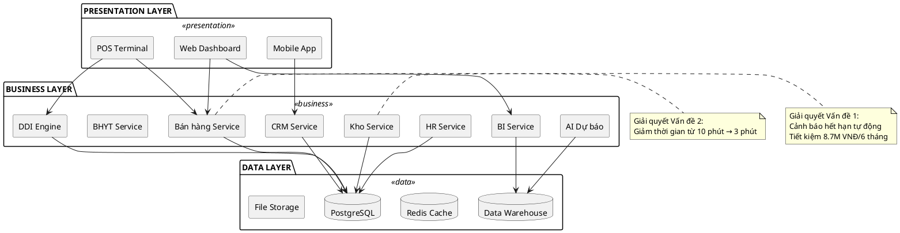

---

## SƠ ĐỒ 2: USE CASE DIAGRAM TỔNG QUAN
**Vị trí:** Hình 2.2 - Phần 2.1.2

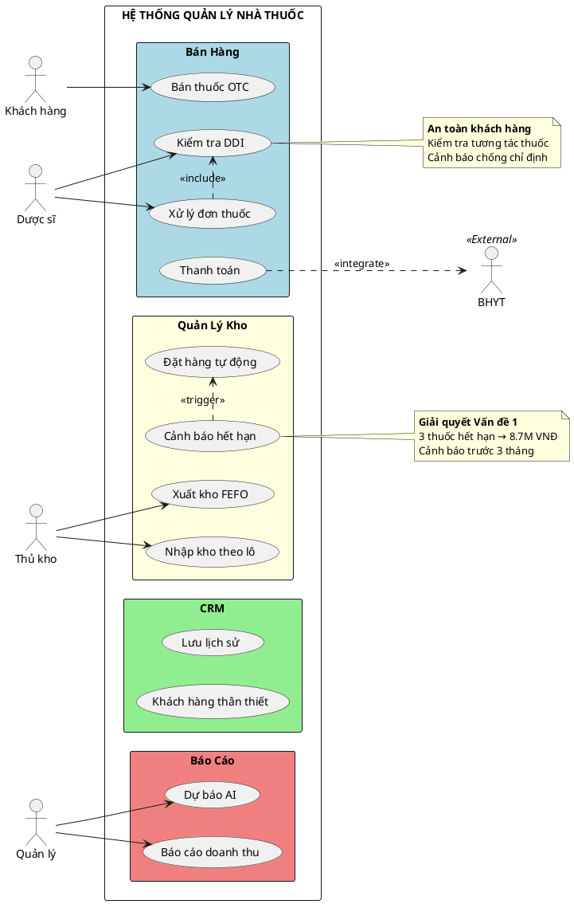

---

## SƠ ĐỒ 3: ACTIVITY DIAGRAM - BÁN HÀNG
**Vị trí:** Hình 2.5 - Quy trình bán thuốc

```plantuml
@startuml
|Khách hàng|
start
:Mang đơn thuốc;

|Dược sĩ|
:Scan/Nhập đơn thuốc;
:OCR đọc tự động;

partition "Kiểm tra an toàn" {
  :Kiểm tra DDI;
  if (Có cảnh báo?) then (Có)
    :Tư vấn thay đổi thuốc;
    :Gọi bác sĩ xác nhận;
  else (Không)
  endif
}

|Thủ kho|
:Lấy thuốc theo FEFO;
note right
  Ưu tiên lô gần hết hạn
  HSD: 2025-06-15 > 2025-12-30
end note

if (Đủ hàng?) then (Đủ)
  :Đóng gói thuốc;
else (Thiếu)
  :Đặt hàng khẩn;
  :Thông báo khách chờ;
  stop
endif

|Thu ngân|
:Tính tiền tự động;
:Quét BHYT (nếu có);
:Thanh toán;

|Hệ thống|
:Cập nhật tồn kho;
:Lưu lịch sử CRM;
:Gửi hóa đơn email;

|Khách hàng|
:Nhận thuốc + hóa đơn;
stop

note bottom
  **Thời gian trước:** 8-12 phút
  **Thời gian sau:** 2-3 phút
  **Cải thiện:** 70% nhanh hơn
end note
@enduml
```

---

## SƠ ĐỒ 4: ACTIVITY DIAGRAM - NHẬP KHO
**Vị trí:** Hình 2.6 - Quy trình nhập kho

```plantuml
@startuml
|NCC|
start
:Giao hàng + hóa đơn;

|Thủ kho|
:Nhận hàng;
:Đối chiếu PO;

if (Đúng số lượng?) then (Sai)
  :Lập biên bản;
  :Thông báo NCC;
  stop
else (Đúng)
endif

:Quét QR Code thuốc;
:Ghi nhận thông tin:
- Số lô (Batch)
- NSX (Mfg Date)
- HSD (Exp Date)
- Số lượng;

if (Thuốc đặc biệt?) then (Có)
  :Kiểm tra giấy phép;
  :Cất kho riêng biệt;
  note right: Thuốc hướng thần, vắc-xin
else (Không)
endif

:Cập nhật hệ thống;
:In tem vị trí kệ;

|Hệ thống|
:Tự động phân loại ABC;
:Thiết lập cảnh báo HSD;
:Cập nhật dự báo;

stop

note right of "Ghi nhận thông tin"
  **Giải quyết Vấn đề 1:**
  - Theo dõi 100% lô hàng
  - Cảnh báo trước 90 ngày
  - Không còn thuốc hết hạn
end note
@enduml
```

---

## SƠ ĐỒ 5: SEQUENCE DIAGRAM - XỬ LÝ ĐƠN THUỐC
**Vị trí:** Hình 2.9 - Tương tác hệ thống

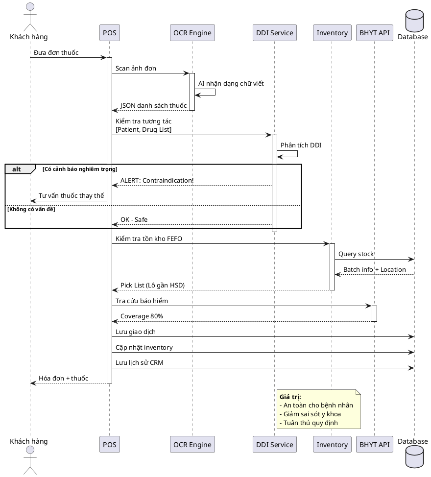

---

## SƠ ĐỒ 6: SEQUENCE DIAGRAM - DỰ BÁO TỰ ĐỘNG
**Vị trí:** Hình 2.10 - AI Forecasting

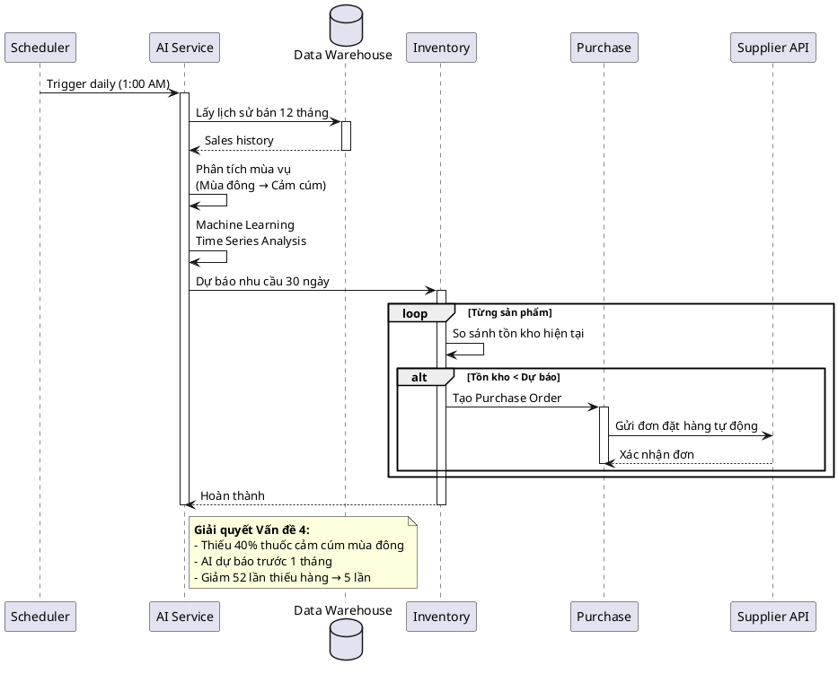

---

## SƠ ĐỒ 7: STATE DIAGRAM - VÒNG ĐỜI LÔ HÀNG
**Vị trí:** Hình 2.13 - Lifecycle Batch

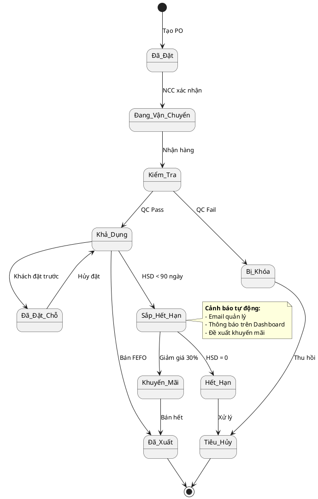

---

## SƠ ĐỒ 8: CLASS DIAGRAM - MÔ HÌNH DỮ LIỆU CHÍNH
**Vị trí:** Hình 2.14 - Database Design

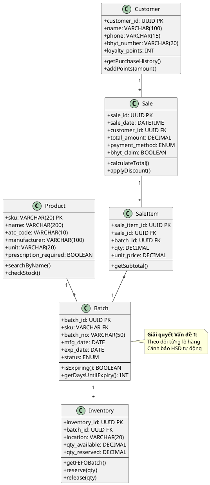

---

## SƠ ĐỒ 9: ERD - CƠ SỞ DỮ LIỆU CHI TIẾT
**Vị trí:** Hình 2.23 - Entity Relationship Diagram

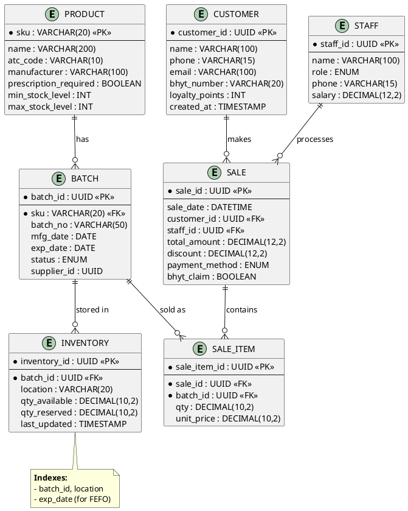

---

## SƠ ĐỒ 10: COMPONENT DIAGRAM - KIẾN TRÚC MODULE
**Vị trí:** Hình 2.18 - Microservices

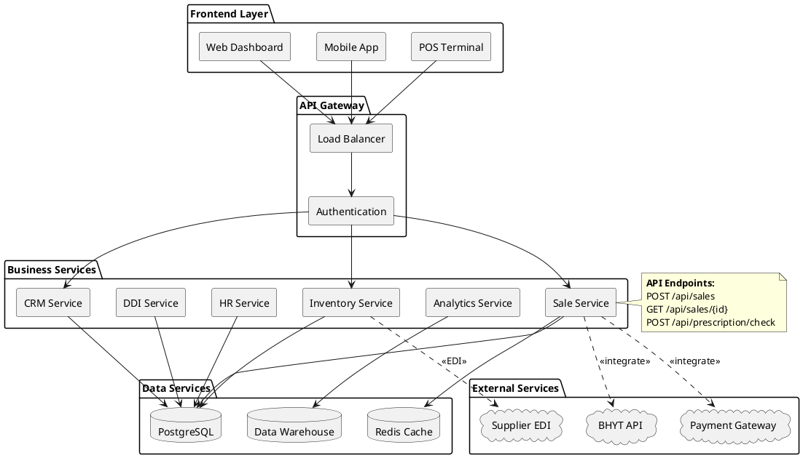

---

## SƠ ĐỒ 11: DEPLOYMENT DIAGRAM - HẠ TẦNG TRIỂN KHAI
**Vị trí:** Hình 2.20 - Infrastructure

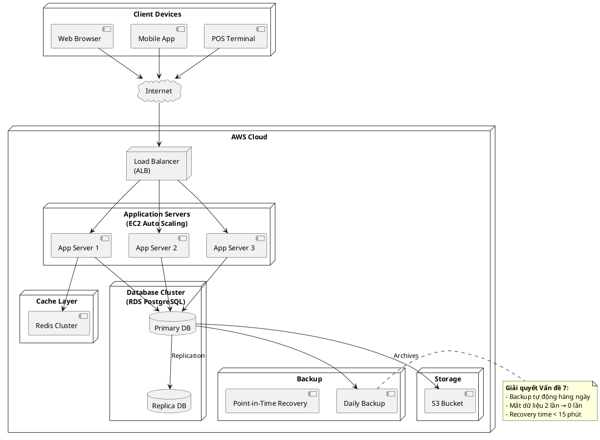

---

## SƠ ĐỒ 12: ACTIVITY DIAGRAM - BÁO CÁO DOANH THU
**Vị trí:** Hình 2.8 - Quy trình báo cáo

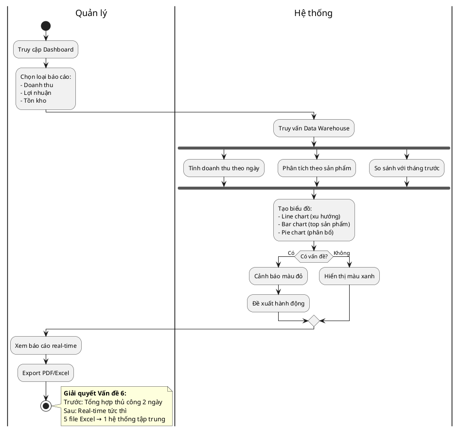

---

## SƠ ĐỒ 13: SEQUENCE DIAGRAM - TÍCH HỢP BHYT
**Vị trí:** Hình 2.12 - BHYT Integration

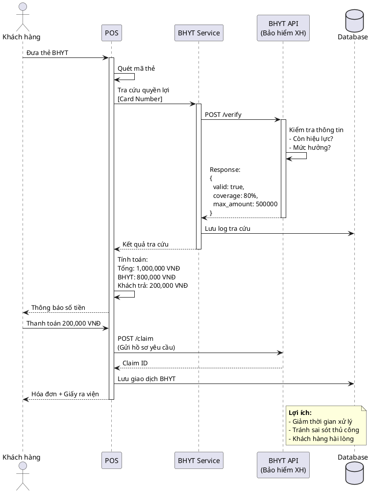

---

## SƠ ĐỒ 14: ACTIVITY DIAGRAM - QUẢN LÝ NHÂN SỰ
**Vị trí:** Hình 2.7 - HR Management

```plantuml
@startuml
|Nhân viên|
start
:Check-in bằng QR Code/\nVân tay;

|Hệ thống HR|
:Ghi nhận thời gian;
:Lưu vào bảng chấm công;

repeat
  :Làm việc ca;
  :Ghi log hoạt động;
repeat while (Hết ca?) is (Chưa)

|Nhân viên|
:Check-out;

|Hệ thống HR|
:Tính số giờ làm việc;
:Tính số giờ tăng ca (nếu có);

note right
  Giờ chuẩn: 8h/ngày
  Tăng ca 150% (19h-22h)
  Tăng ca 200% (22h-6h)
end note

partition "Cuối tháng" {
  |Hệ thống HR|
  :Tổng hợp công;
  :Tính lương cơ bản;
  :Cộng lương tăng ca;
  :Cộng thưởng KPI;
  :Trừ bảo hiểm;
  
  :Tạo bảng lương;
  
  |Quản lý|
  :Duyệt bảng lương;
  
  |Hệ thống HR|
  :Chuyển khoản tự động;
  :Gửi payslip qua email;
}

|Nhân viên|
:Nhận lương + payslip;
stop

note bottom
  **Giải quyết Vấn đề 5:**
  Trước: Tính sai 2 lần, 1.8M VNĐ
  Sau: 100% chính xác, tự động
end note
@enduml
```

---

## SƠ ĐỒ 15: COMPONENT DIAGRAM - TÍCH HỢP HỆ THỐNG BÊN NGOÀI
**Vị trí:** Hình 2.32 - External Integration

```plantuml
@startuml
skinparam componentStyle rectangle

package "Hệ Thống Nội Bộ" {
  component [API Gateway] as GW
  component [Sale Service] as SALE
  component [Inventory Service] as INV
  component [Payment Service] as PAY
}

package "Hệ Thống Bên Ngoài" {
  
  cloud "BHYT" {
    component [BHYT Portal] as BHYT
    note right: Bảo hiểm Y tế Xã hội
  }
  
  cloud "Ngân hàng & Ví điện tử" {
    component [VNPay] as VNPAY
    component [MoMo] as MOMO
    component [ZaloPay] as ZALO
  }
  
  cloud "Nhà cung cấp" {
    component [Supplier A EDI] as SUP_A
    component [Supplier B API] as SUP_B
  }
  
  cloud "Dịch vụ Cloud" {
    component [AWS S3\n(File Storage)] as S3
    component [SendGrid\n(Email)] as EMAIL
    component [Twilio\n(SMS)] as SMS
  }
  
  cloud "Cơ sở dữ liệu DDI" {
    component [DrugBank API] as DDI
    component [FDA Database] as FDA
  }
}

GW --> SALE
GW --> INV
GW --> PAY

SALE ..> BHYT : HTTPS/REST
SALE ..> DDI : API Call
SALE ..> FDA : Lookup

PAY ..> VNPAY : Payment API
PAY ..> MOMO : Payment API
PAY ..> ZALO : Payment API

INV ..> SUP_A : EDI/X12
INV ..> SUP_B : REST API

SALE ..> S3 : Upload Rx Images
SALE ..> EMAIL : Send Invoice
SALE ..> SMS : Send Reminder

note right of BHYT
  **Protocol:** SOAP/XML
  **Auth:** OAuth 2.0
  **Timeout:** 30s
end note

note right of DDI
  **Dữ liệu:**
  - 5000+ thuốc
  - 15000+ tương tác
  - Update hàng tuần
end note

@enduml
```

---

## HƯỚNG DẪN SỬ DỤNG

### Cách thay thế vào file chính:

1. **Mở file:** `BAO_CAO_HOAN_CHINH_FULL.md`
2. **Tìm vị trí:** Tìm tiêu đề tương ứng (ví dụ: "Hình 2.0", "Hình 2.2"...)
3. **Xóa sơ đồ cũ:** Xóa từ ` ```plantuml` đến ` ``` ` 
4. **Paste sơ đồ mới:** Copy sơ đồ từ file này

### Thứ tự ưu tiên nếu chỉ muốn 10 sơ đồ:

✅ **Top 10 quan trọng nhất:**
1. Sơ đồ 1: Kiến trúc 3 tầng
2. Sơ đồ 2: Use Case tổng quan
3. Sơ đồ 3: Activity - Bán hàng
4. Sơ đồ 4: Activity - Nhập kho
5. Sơ đồ 5: Sequence - Xử lý đơn thuốc
6. Sơ đồ 7: State - Vòng đời lô hàng
7. Sơ đồ 8: Class Diagram
8. Sơ đồ 9: ERD
9. Sơ đồ 10: Component Diagram
10. Sơ đồ 11: Deployment Diagram

### Lợi ích của bộ sơ đồ này:

✅ **Tập trung vào giải pháp:** Mỗi sơ đồ gắn với 1 trong 7 vấn đề
✅ **Rõ ràng cho MIS:** Nhấn mạnh nghiệp vụ, không quá kỹ thuật
✅ **Có số liệu cụ thể:** 8.7M VNĐ, 70% nhanh hơn, 40% thiếu hàng...
✅ **PlantUML chuẩn:** Render được ngay trên VS Code, GitHub
✅ **Professional:** Màu sắc, layout đẹp, dễ đọc

---

**Tác giả:** AI Assistant  
**Ngày tạo:** 04/11/2025  
**Phiên bản:** 1.0  
**Cho dự án:** Hệ thống quản lý Nhà thuốc Long Châu 175 Tây Sơn
